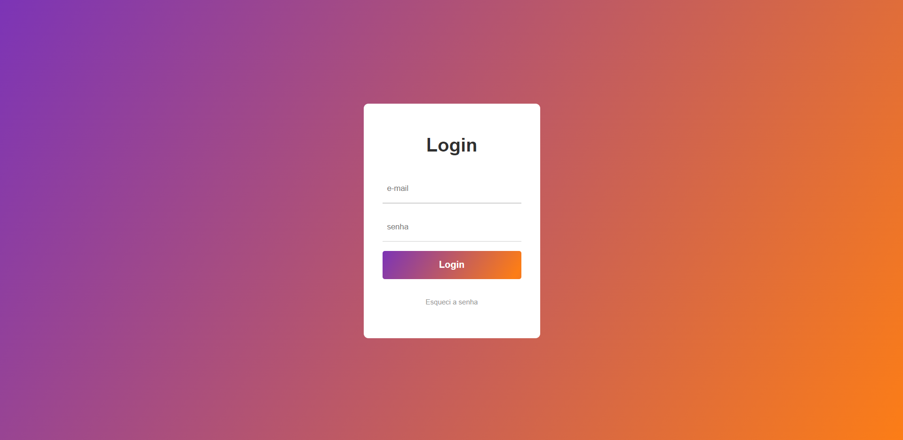

[](https://github.com/marioandre01)
[](#)
[](https://github.com/marioandre01/formulario_de_login_JS/stargazers)
[](https://github.com/marioandre01/formulario_de_login_JS/network/members)
[](https://github.com/marioandre01/formulario_de_login_JS/graphs/contributors)
[](https://github.com/marioandre01/formulario_de_login_JS/blob/master/LICENCE.md)


<h1 align="center">
    formulario_de_login_JS
</h1>

<p align="center"> 
  <a href="#-projeto">Projeto</a>&nbsp;&nbsp;&nbsp;|&nbsp;&nbsp;&nbsp;
  <a href="#-tecnologias">Tecnologias</a>&nbsp;&nbsp;&nbsp;|&nbsp;&nbsp;&nbsp;
  <a href="#-layout">Layout</a>&nbsp;&nbsp;&nbsp;|&nbsp;&nbsp;&nbsp;
  <a href="#-executando-a-aplicação">Executando a aplicação</a>&nbsp;&nbsp;&nbsp;|&nbsp;&nbsp;&nbsp;
  <a href="#gear-contribuição">Contribuição</a>&nbsp;&nbsp;&nbsp;|&nbsp;&nbsp;&nbsp;
  <a href="#memo-licença">Licença</a>
</p>

## 💻 Projeto

Esse projeto foi desenvolvido através de uma sequencia de aulas oferecida pela Frontend Enginner Gabriela Pinheiro em seu [canal do youtube](https://www.youtube.com/c/GabrielaPinheiro/videos). O projeto tem como objetivo criar uma pagina de login utilizando HTML, CSS e Javascript. Com o CSS foi feito algumas estilizações animadas e o javascript foi usado para fazer a validação do login e senha uilizando a API do site [https://reqres.in](https://reqres.in/).

Nos campos login e senha deve-se colocar: <br>
**Login:** eve.holt@reqres.in <br>
**Senha:** cityslicka

Como resultado deve-se ter como retorno o seguinte token: <br>
**{token: "QpwL5tke4Pnpja7X4"}**

Para ver o token abrir o console do navegador.

O resultado da aplicação pode ser acessado através da seguinte URL: [https://marioandre01.github.io/formulario_de_login_JS](https://marioandre01.github.io/formulario_de_login_JS)


## 📋 Tecnologias

O projeto foi desenvolvido com as seguintes tecnologias:

- HTML
- CSS
- Javascript

## 🎨 Layout

<p align="center">
  
</p>


<!-- ## :bulb: Funcionamento da aplicação !-->


## 💻 Executando a aplicação

### Requisitos necessários

Para executar o projeto é necessário ter:
- Navegador web

### :octocat: Clonando o Repositório

```bash
$ git clone https://github.com/marioandre01/formulario_de_login_JS.git

# entre na pasta do projeto
$ cd formulario_de_login_JS
```
### 💻 Executando a aplicação

Abra o arquivo index.html

## :gear: Contribuição

Para contribuir com esse projeto faça os seguintes passos:

- Faça um fork desse repositório;
- Crie uma branch com a sua feature: `git checkout -b minha-feature`;
- Faça commit das suas alterações: `git commit -m 'feat: Minha nova feature'`;
- Faça push para a sua branch: `git push origin minha-feature`.

## :memo: Licença

Esse projeto está sob a licença MIT. Veja o arquivo [LICENSE](./LICENSE.md) para mais detalhes.


